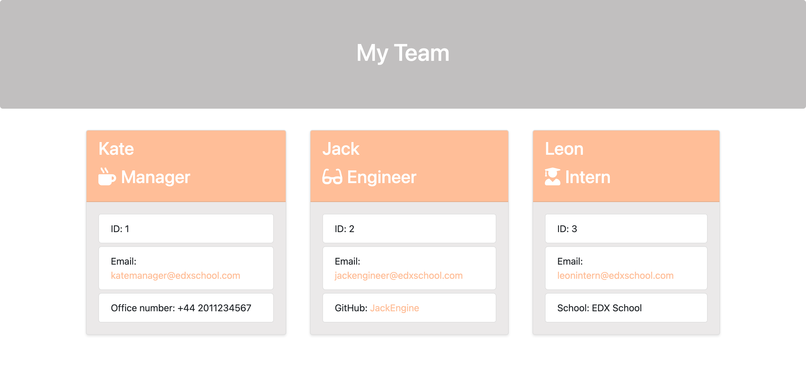

# Challenge 12: Team Profile Generator

## Table of Contents
- [Description](#description)
- [Motivation](#motivation)
- [User Story](#user-story)
- [Features](#features)
- [Installation and Usage](#installation-and-usage)
- [Technologies Used](#technologies-used)
- [Testing Instructions](#testing-instructions)
- [Contribution Guidelines](#contribution-guidelines)
- [GitHub Repository](#github-repository)
- [Credits](#credits)
- [License](#license)
- [Badges](#badges)
- [Questions](#questions)

## Description

A Node.js command-line tool called Team Profile Generator accepts user inputs to dynamically create a presentable HTML webpage that summarises the members of an IT engineering project. 

## Motivation

The goal of this project was to streamline the creation of team profiles so that managers could quickly produce a webpage that included information about their team. This tool facilitates better member information accessibility and team organisation.

## User Story

AS A manager
I WANT to generate a webpage that displays my team's basic information
SO THAT I have quick access to their emails and GitHub profiles.

## Features

- Command-line prompts to input team members' details.
- Supports roles: Manager, Engineer, and Intern.
- Dynamically generated HTML file for team profiles.
- Customizable styling for the generated webpage.

## Installation and Usage

- Clone the repository to your local machine.
- Navigate to the project directory and run `npm install` to install dependencies.
- Start the application by running `node index.js`.
- Follow the command-line prompts to enter team member details.
- The generated HTML file will be saved in the `output` directory.
The following image shows a mock-up of the generated HTML’s appearance and functionality:

MOCKUP provided within the starter pack: HTML webpage titled “My Team” features five boxes listing employee names, titles, and other key info:

[Sample of the new app generated HTML web page](./output/team.html)

Key personnel information is displayed on a newly created HTML webpage created by the app:

## Technologies Used

Bootstrap  
Inquirer.js  
JavaScript  
Jest (for running unit tests)  
HTML/CSS  
Node.js
npm    
Shields.io    
Visual Studio Code  

## Testing Instructions

Run `npm test` to execute the unit tests via Jest. Ensure all tests pass for the classes defined in the `lib` directory.

## Contribution Guidelines

Contributions are welcome. Please fork the repository and submit a pull request with your proposed changes or enhancements.

## GitHub Repository

[Link to the GitHub repository for the Professional Team Profile Generator](https://github.com/Natt5/challenge12-team-profile-generator)

## Credits

The following resources were instrumental in this project’s completion:

[Badge generation via Shields.io](https://shields.io/)

[Coding Boot Camp: Professional README Guide](https://coding-boot-camp.github.io/full-stack/github/professional-readme-guide)  

[Inquirer package](https://www.npmjs.com/package/inquirer)

[Jest package](https://www.npmjs.com/package/jest)  

[Markdown Guide](https://www.markdownguide.org/)

[Node.js guide](https://nodejs.org/en/learn/getting-started/introduction-to-nodejs)

[Node.js tutorials](https://www.geeksforgeeks.org/nodejs/?ref=shm)

## License

This project is licensed under the [MIT License](https://opensource.org/licenses/MIT).

## Badges

## Questions

For any questions or further information, please contact me via:
- GitHub: [Natt5](https://github.com/Natt5)
- Email Address: [Contact me](mailto:contactmeviagithub@gmail.com)